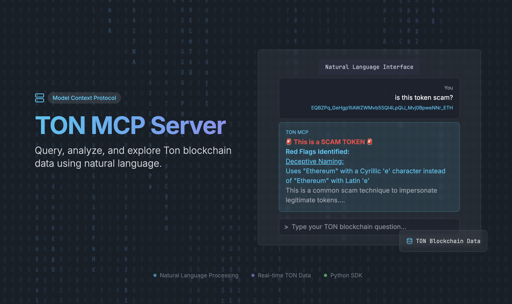
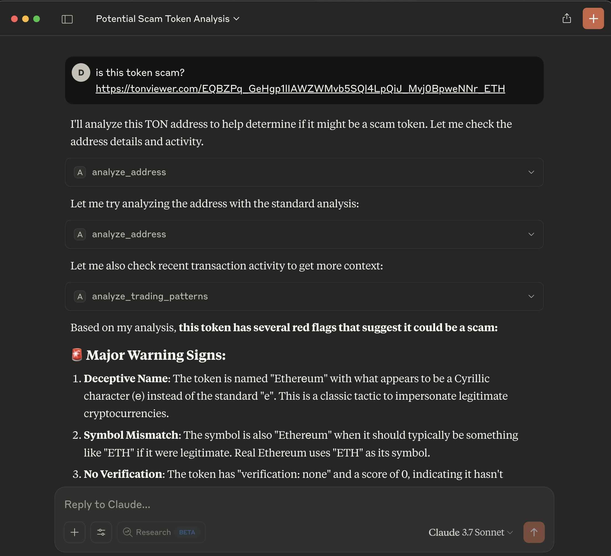
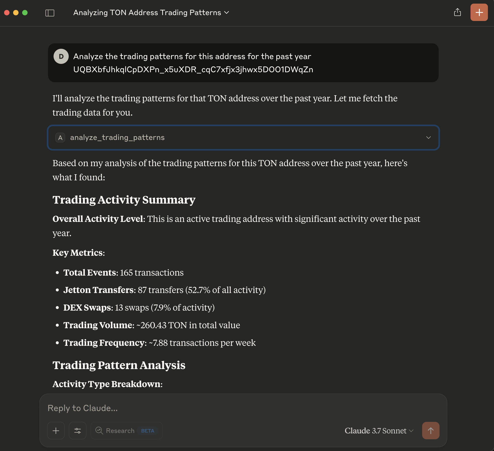

# TON BLOCKCHAIN MCP 

A Model Context Protocol (MCP) server for natural language interaction with the [TON blockchain](http://ton.org/).



## Features

- **Natural Language Processing**: Understand complex blockchain queries in plain English
- **Trading Analysis**: Analyze trading patterns, profitability, and strategies
- **Hot Trends Detection**: Find trending tokens, active pools, and high-activity accounts
- **Forensics & Compliance**: Conduct blockchain investigations and compliance checks
- **Real-time Data**: Access live TON blockchain data through TON API

## Quick Start

### Prerequisites

- Python 3.10+
- TON API key from [TONAPI](https://tonconsole.com/tonapi)

### Installation

1. Clone the repository:
```bash
git clone https://github.com/devonmojito/ton-blockchain-mcp-remote.git
cd ton-blockchain-mcp-remote
```

2. Install dependencies:
```bash
pip install -r requirements.txt
```

3. (Optional) Set up environment variables:
* You may want to put your TON API key in a `.env` file for convenience, but it is not required for running the server if you use the default/test configuration.

4. Run the server (SSE mode):
```bash
PYTHONPATH=src python -m tonmcp.mcp_server runserver
```

This will start the FastAPI server with SSE endpoints for MCP protocol at `http://localhost:8000/sse` and `http://localhost:8000/messages/`.

### PyPI Installation

You can also install the TON MCP Server directly from PyPI:

```bash
pip install ton-mcp-server
```

### Using Docker

```bash
# Build and run with Docker Compose
docker-compose up --build
```

---

## Example: Using TON MCP Server with Claude Desktop

You can easily use this MCP server with Claude Desktop for natural language blockchain queries. Below are some example use cases:

**Scam Detection Example:**



**Analyze Address Example:**


**Get Transaction Details Example:**


**Analyze Trading Patterns Example:**



### Claude Desktop Configuration Example

To use this MCP server with Claude Desktop, add the following to your Claude Desktop config:
* You might need to replace the Python env setup with your own.

```json
{
  "mcpServers": {
    "ton-mcp-server": {
      "command": "/Users/devon/ton-mcp/ton-mcp-server/venv/bin/python",
      "args": [
        "-m",
        "tonmcp.mcp_server",
        "runserver"
      ],
      "cwd": "/Users/devon/ton-mcp/ton-mcp-server/src",
      "env": {
        "PYTHONPATH": "/Users/devon/ton-mcp/ton-mcp-server/src"
      }
    }
  }
}
```

---

## Usage

### Basic Queries (SSE Client Example)

The server uses Server-Sent Events (SSE) for communication. You can use the provided example client in `examples/sse_claude_client.py` to interact with the server:

```bash
pip install httpx sseclient-py requests
python examples/sse_claude_client.py
```

This client will connect to the `/sse` endpoint, perform the MCP handshake, and call tools such as `analyze_address`.

### Natural Language Examples

- "What's the balance of address EQD1234...?"
- "Find hot trading pairs in the last hour"
- "Analyze trading patterns for this wallet"
- "Show suspicious activity for address ABC"
- "Trace money flow from this address"

## Configuration

Configuration can be provided via:
- Environment variables (optional)
- `config/settings.json` file (optional)
- Runtime parameters (optional)

Key configuration options:
- `MCP_HOST`: Server host (default: localhost)
- `MCP_PORT`: Server port (default: 8000)
- `LOG_LEVEL`: Logging level (default: INFO)

## MCP Tools & System Prompts Documentation

### Tools

#### analyze_address
Analyze a TON address for its balance, jetton holdings, NFTs, and recent activity. Optionally performs deep forensic analysis if `deep_analysis` is True. Use for questions about account overview, holdings, or activity.

**Parameters:**
- `address` (str): TON address to analyze
- `deep_analysis` (bool, optional): Enable deep forensic analysis

#### get_transaction_details
Get details and analysis for a specific TON blockchain transaction by its hash. Use for questions about a particular transaction, its participants, value, or type.

**Parameters:**
- `tx_hash` (str): Transaction hash

#### find_hot_trends
Find trending tokens, pools, or accounts on the TON blockchain for a given timeframe and category. Use for questions about what's hot, trending, or popular on TON.

**Parameters:**
- `timeframe` (str, optional): Time period (e.g., 1h, 24h, 7d)
- `category` (str, optional): Type of trends (tokens, pools, accounts)

#### analyze_trading_patterns
Analyze trading patterns for a TON address over a specified timeframe. Use for questions about trading activity, frequency, jetton transfers, or DEX swaps for an account.

**Parameters:**
- `address` (str): TON address
- `timeframe` (str, optional): Time period (e.g., 24h)

#### get_ton_price
Get the current real-time TON price in the specified currency (default: USD) and recent price changes. Use this tool whenever you need the latest TON price for calculations, analysis, or reporting.

**Parameters:**
- `currency` (str, optional): The fiat or crypto currency to get the TON price in (default: 'usd').

#### get_jetton_price
Get the current price and recent changes for specified jetton tokens (not TON) in the given currency. Provide a list of jetton master addresses as tokens. Use this tool to fetch real-time prices for any token except TON.

**Parameters:**
- `tokens` (list of str): List of jetton master addresses to get prices for (excluding 'ton').
- `currency` (str, optional): The fiat or crypto currency to get the price in (default: 'usd').

### System Prompts

- `trading_analysis`: Generate trading analysis prompts
- `forensics_investigation`: Generate forensics prompts
- `trend_analysis`: Generate trend analysis prompts

## Contributing

1. Fork the repository
2. Create a feature branch
3. Commit your changes
4. Push to the branch
5. Create a Pull Request

## License

This project is licensed under the MIT License - see the [LICENSE](LICENSE) file for details.

## Support

For support, please open an issue on GitHub 

**⚠️ WARNING: This project is in Beta. Do not trust any numbers provided by the LLM model. Nothing in this project constitutes financial advice. Use at your own risk.**

## Remote MCP Server (SSE/HTTP) Usage

To run the server as a remote MCP server (supporting both SSE and HTTP transports):

1. Set your API key in the environment:

   ```sh
   export API_KEY=your_secret_key
   # or
   export TON_API_KEY=your_secret_key
   ```

2. Start the server with FastAPI (using Uvicorn):

   ```sh
   python -m src.tonmcp.mcp_server runserver
   # or
   uvicorn src.tonmcp.mcp_server:app --host 0.0.0.0 --port 8000
   ```

3. Endpoints:
   - `GET /sse` — SSE transport (for VS Code, Claude, etc.)
   - `POST /mcp` — Streamable HTTP transport (future-proof)
   - Both require `x-api-key` header with your API key.
   - `GET /healthz` — Health check

Example request (with curl):

```sh
curl -H "x-api-key: your_secret_key" http://localhost:8000/healthz
```

## Local STDIO Mode (for development)

To run the server locally (STDIO transport):

```sh
export TON_API_KEY=your_secret_key
python -m src.tonmcp.mcp_server
```

## Running Locally

To start the MCP server and agent for local development:

1. **Start the MCP Server:**
   - Run the provided script:
     ```sh
     bash run_local.sh
     ```
   - Or manually:
     ```sh
     export PYTHONPATH=$PWD/src
     uvicorn tonmcp.mcp_server:app --reload --port 8000
     ```

2. **Start the Agent (in a new terminal):**
   ```sh
   python3 ton_agent/app.py
   ```

Make sure your `.env` file is configured with the correct keys and `TON_AGENT_SERVER_MODE=local` for local development.
